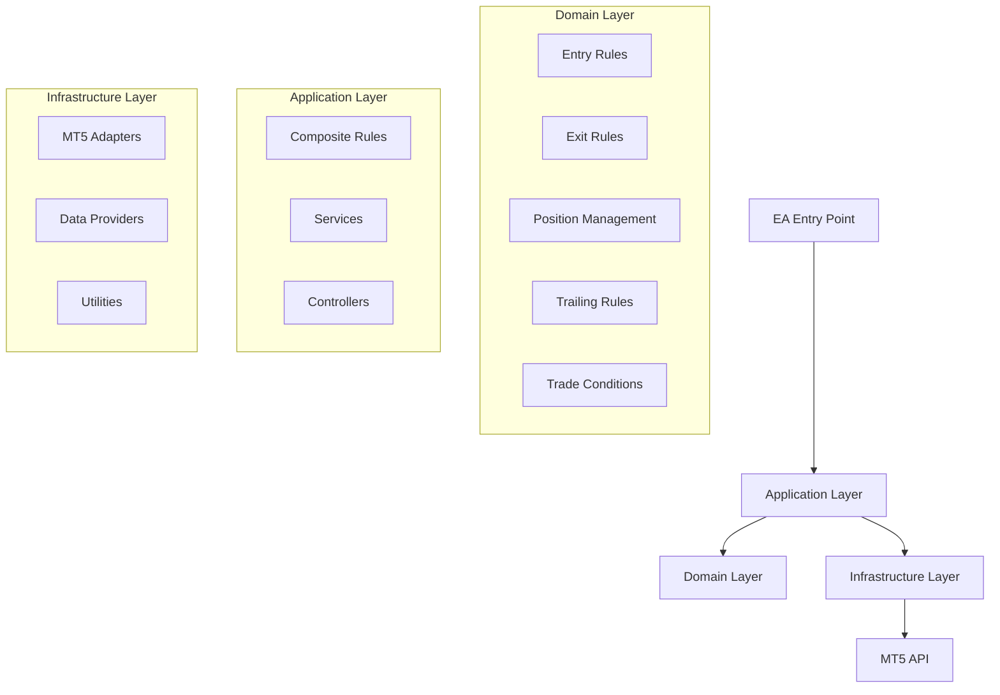
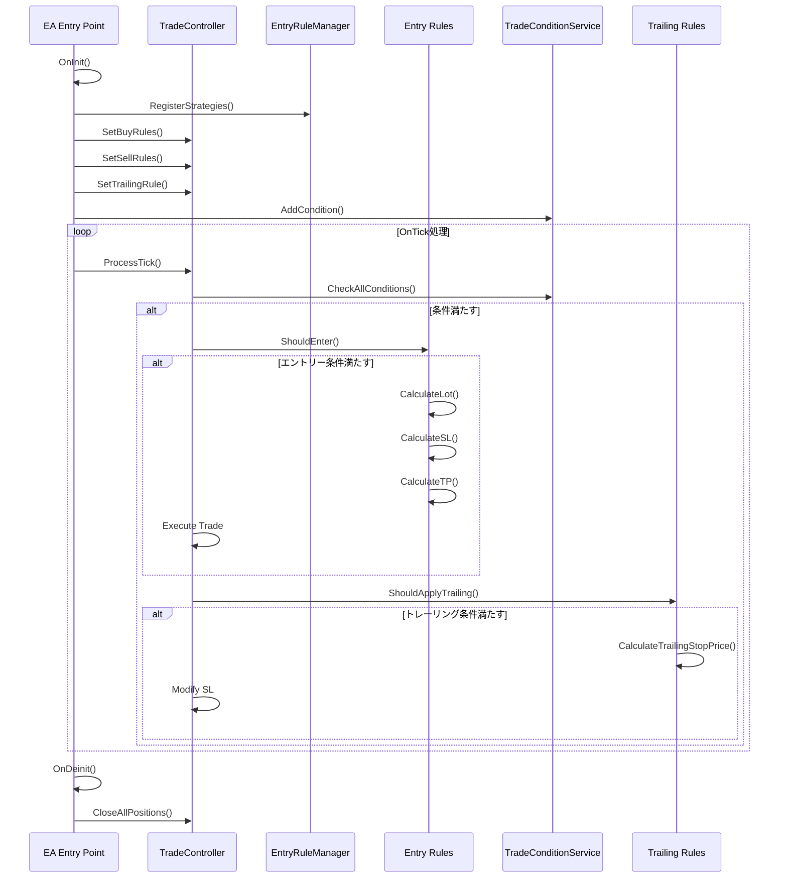
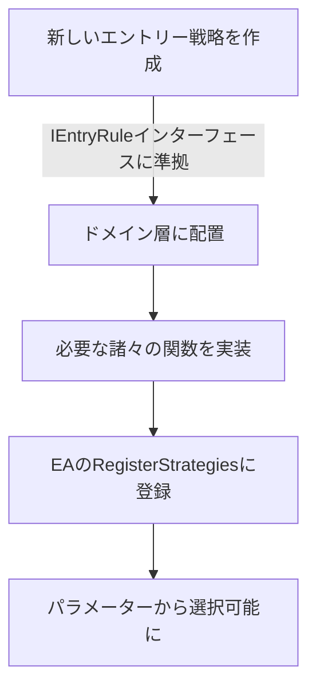
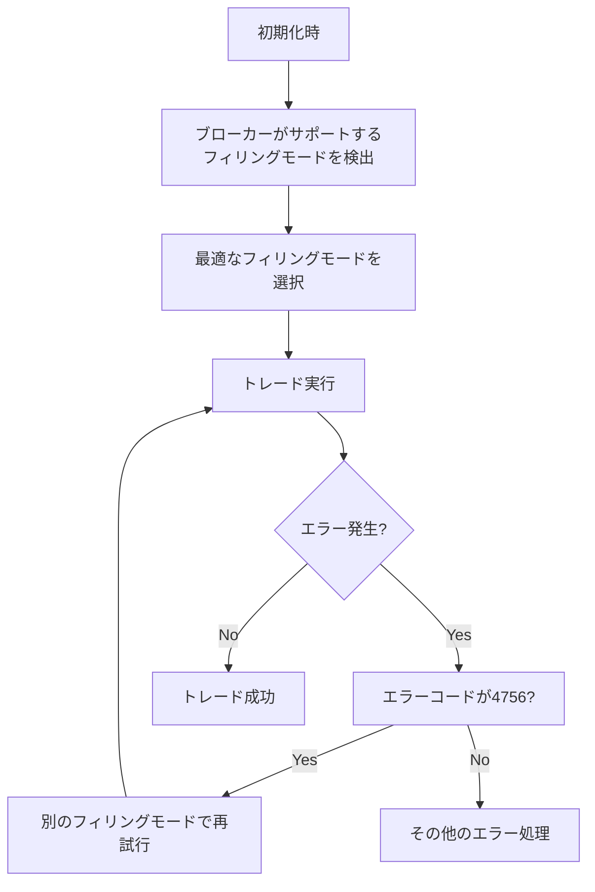

# MQL5トレーディングフレームワーク設計書

## 基本設計思想

このフレームワークは、クリーンアーキテクチャを取り入れたMQL5用トレーディングシステムです。主な設計思想は以下の通りです：

1. **責任の分離**: ドメイン層、アプリケーション層、インフラストラクチャ層に明確に分離
2. **ポリモーフィズム**: MQL5ではinterface機能が制限されているため、ダックタイピングとクラス継承を活用
3. **Compositeパターン**: 複合条件を柔軟に構築可能なCompositeパターンの実装
4. **依存性の注入**: 具象クラスへの直接依存を避け、疎結合な設計
5. **エラー処理**: MT5 API特有のエラー（特にフィリングモード関連）に対する堅牢な処理
6. **パフォーマンス最適化**: MT5環境でのパフォーマンスを考慮した実装

## アーキテクチャ概要



## クラス図

```mermaid
classDiagram
    class IEntryRule {
        <<interface>>
        +ShouldEnter(string, ENUM_TIMEFRAMES) bool
        +GetOrderType() ENUM_ORDER_TYPE
        +CalculateLot(string, double) double
        +CalculateSL(string, ENUM_ORDER_TYPE, double) double
        +CalculateTP(string, ENUM_ORDER_TYPE, double) double
    }
    
    class ITrailingRule {
        <<interface>>
        +ShouldApplyTrailing(string, ENUM_TIMEFRAMES) bool
        +CalculateTrailingStopPrice(string, ENUM_ORDER_TYPE, double) double
    }
    
    class ITradeCondition {
        <<interface>>
        +Check(string, ENUM_TIMEFRAMES) bool
        +GetFailureMessage() string
    }
    
    class CompositeEntryRule {
        -void* m_rules[]
        -int m_ruleCount
        -ENUM_ORDER_TYPE m_orderType
        +CompositeEntryRule(ENUM_ORDER_TYPE)
        +~CompositeEntryRule()
        +AddRule(void*) bool
        +GetOrderType() ENUM_ORDER_TYPE
        +CalculateLot(string, double) double
        +CalculateSL(string, ENUM_ORDER_TYPE, double) double
        +CalculateTP(string, ENUM_ORDER_TYPE, double) double
    }
    
    class AndEntryRule {
        +AndEntryRule(ENUM_ORDER_TYPE)
        +ShouldEnter(string, ENUM_TIMEFRAMES) bool
    }
    
    class OrEntryRule {
        +OrEntryRule(ENUM_ORDER_TYPE)
        +ShouldEnter(string, ENUM_TIMEFRAMES) bool
    }
    
    class MABuyStrategy {
        -int m_maPeriod
        -int m_maShift
        -int m_handle
        +MABuyStrategy(int, int)
        +~MABuyStrategy()
        +ShouldEnter(string, ENUM_TIMEFRAMES) bool
        +GetOrderType() ENUM_ORDER_TYPE
        +CalculateLot(string, double) double
        +CalculateSL(string, ENUM_ORDER_TYPE, double) double
        +CalculateTP(string, ENUM_ORDER_TYPE, double) double
        +Signal(string, ENUM_TIMEFRAMES) ENUM_ORDER_TYPE
        -CalculateConsecutiveLosses() int
    }
    
    class MASellStrategy {
        -int m_maPeriod
        -int m_maShift
        -int m_handle
        +MASellStrategy(int, int)
        +~MASellStrategy()
        +ShouldEnter(string, ENUM_TIMEFRAMES) bool
        +GetOrderType() ENUM_ORDER_TYPE
        +CalculateLot(string, double) double
        +CalculateSL(string, ENUM_ORDER_TYPE, double) double
        +CalculateTP(string, ENUM_ORDER_TYPE, double) double
        +Signal(string, ENUM_TIMEFRAMES) ENUM_ORDER_TYPE
        -CalculateConsecutiveLosses() int
    }
    
    class TradeController {
        -CTrade m_trade
        -void* m_buyRules
        -void* m_sellRules
        -ITrailingRule* m_trailingRule
        -ulong m_lastTickTime
        -bool m_isNewBar
        -datetime m_lastBarTime
        +TradeController()
        +~TradeController()
        +SetMagicNumber(int)
        +SetBuyRules(void*)
        +SetSellRules(void*)
        +SetTrailingRule(ITrailingRule*)
        +ProcessTick(string, ENUM_TIMEFRAMES)
        +CloseAllPositions()
        -GetSupportedFillingMode() ENUM_ORDER_TYPE_FILLING
        -IsNewBar(string, ENUM_TIMEFRAMES) bool
    }
    
    class EntryRuleManager {
        -void* m_rules[string]
        +EntryRuleManager()
        +~EntryRuleManager()
        +RegisterRule(void*, string) bool
        +GetRule(string) void*
        +HasRule(string) bool
    }
    
    class TrailingRuleManager {
        -ITrailingRule* m_rules[string]
        +TrailingRuleManager()
        +~TrailingRuleManager()
        +RegisterRule(ITrailingRule*, string) bool
        +GetRule(string) ITrailingRule*
        +HasRule(string) bool
    }
    
    class CTradeConditionService {
        -ITradeCondition* m_conditions[]
        +CTradeConditionService()
        +~CTradeConditionService()
        +AddCondition(ITradeCondition*)
        +CheckAllConditions(string, ENUM_TIMEFRAMES) bool
    }
    
    CompositeEntryRule --|> IEntryRule : implements
    AndEntryRule --|> CompositeEntryRule : extends
    OrEntryRule --|> CompositeEntryRule : extends
    MABuyStrategy --|> IEntryRule : implements
    MASellStrategy --|> IEntryRule : implements
    
    TradeController o-- IEntryRule : uses
    TradeController o-- ITrailingRule : uses
    EntryRuleManager o-- IEntryRule : manages
    TrailingRuleManager o-- ITrailingRule : manages
    CTradeConditionService o-- ITradeCondition : manages
```



## 処理の流れ



## 戦略の追加方法

### 新しいエントリールール追加の流れ


### エントリールール実装例
```cpp
// 1. 新しいエントリールールの定義
class RSIEntryRule
{
public:
    RSIEntryRule(int period, double level) {
        // 初期化処理
    }
    
    bool ShouldEnter(string symbol, ENUM_TIMEFRAMES timeframe) {
        // RSI値がlevelを下回ったら買いエントリー
        return オーバーソールド条件;
    }
    
    ENUM_ORDER_TYPE GetOrderType() {
        return ORDER_TYPE_BUY;
    }
    
    // 他の必要なメソッドを実装
};

// 2. 複合ルールへの追加
AndEntryRule *andRule = new AndEntryRule(ORDER_TYPE_BUY);
andRule.AddRule(new MABuyStrategy(10, 0));
andRule.AddRule(new RSIEntryRule(14, 30));

// 3. ルールマネージャーへの登録
g_entryRuleManager.RegisterRule(andRule, "MA_AND_RSI");
```

## MQL5における設計上の制約と対応

### インターフェース実装の制約

MQL5ではインターフェースキーワードがサポートされていないため、以下の方法でポリモーフィズムを実現しています：

1. **抽象クラスの使用**: 純粋仮想関数を持つ抽象クラスを定義
2. **ダックタイピング**: 同一のメソッドシグネチャを持つクラスを実装
3. **void*ポインタ**: 型安全性は低下するがメモリ効率の良い実装

### フィリングモード対応

ブローカーによって対応しているフィリングモードが異なる問題に対応するため：



## パフォーマンス最適化

このフレームワークでは以下のパフォーマンス最適化を実装しています：

1. **インジケーターハンドルの再利用**: ティックごとに新しいハンドルを作成せず、再利用
2. **バーのキャッシング**: 同じバー内の複数回の呼び出しに対してキャッシングを実装
3. **メモリ管理**: 動的割り当てオブジェクトの適切な解放とメモリリークの防止
4. **新しいバーの判定**: 不要な計算を避けるため、新しいバーの開始時のみ特定の処理を実行

## 今後の拡張ポイント

1. **より多様な戦略**: オシレーターや価格アクション、パターン認識などの戦略の追加
2. **リスク管理の強化**: ポジションサイジングやドローダウン管理の改善
3. **バックテスト分析機能**: 戦略の効果を分析するためのレポート機能
4. **スケーラビリティ**: 複数通貨ペアや時間枠を管理する機能の追加
5. **機械学習との統合**: 予測モデルを取り込むためのインターフェースの開発
6. **通知システムの実装**: エントリー・決済時に以下の通知機能を提供
   - プッシュ通知: モバイルデバイスへのリアルタイム通知
   - メール通知: 取引執行時の詳細なレポートメール送信
   - サウンド通知: 取引所でのシグナル音
   - カスタム通知チャネル: Telegram、Discord等への通知連携
   - 通知フィルター: 重要度や取引タイプに基づく通知設定

この設計書を基に、機能や戦略を拡張し、トレーディングシステムをさらに進化させることができます。 